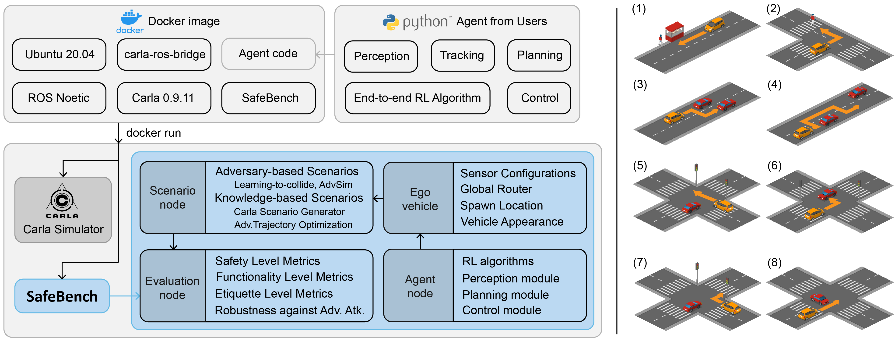

<!--
 * @Date: 2021-07-18 21:43:53
 * @LastEditTime: 2021-08-25 19:45:48
 * @Description: 
-->
# SafeBench: A Benchmarking Platform for Safety Evaluation of Autonomous Vehicles

## This version is out-of-date, please check the laste repo of [Safebench](https://github.com/trust-ai/SafeBench)

This is an evaluation platform based on Carla Simulator. The structure of this platform is shown in this figure:


## Instructions

**Note**: these instructions are for users who want to run SafeBench on a desktop with a physical display plugged in. You can also check out [this video](https://drive.google.com/file/d/1JAY4veYIICv66DzI4a2rzw2BhThRbqrO/view?usp=sharing) which shows how to run the following steps and what are their effects. For users who want to run SafeBench on a remote server without physical screens, please follow the instructions [here](./docker).

Firstly, make sure you already install the NVIDIA driver on your mechine. All environment settings are store in a docker image, please follow the instructions below to install all things.

### Step 1. Download docker image

1. Install Docker by following [this link](https://docs.docker.com/engine/install/ubuntu/).
2. Install NVIDIA-Docker2 by following [this link](https://docs.nvidia.com/datacenter/cloud-native/container-toolkit/install-guide.html#docker).
3. Pull the [Docker image](https://hub.docker.com/r/garyxcj/carla): `docker pull garyxcj/carla`

### Step 2. Download source code and checkpoints

Download the source code from this repo: 
`git clone https://github.com/trust-ai/SafeBench.git`

We also provide the checkpoints of the RL models used in our paper. You can download them [here](https://drive.google.com/drive/folders/1ONBoqMV6ngzn4szAIU1iLXRw9m8TT5UR?usp=sharing).

### Step 3. Run the Docker container

The command of running the container is in `run_docker.sh`, you just need to run this script. After running it, a window of the Carla Simulator will show up.

### Step 4. Access container bash and launch the entire platform

1. Open a new terminal window and run the script `run_bash.sh` to access the bash of container.
2. Install required packages:
    ```
    cd Evaluation/src/agent/gym_node/
    sudo pip3 install -e .
    ```
   The password for user `carla` is `carla`.


3. Complile all files with ROS tools and set up environment:
    ```
    cd ~/Evaluation
    catkin_make
    . ./devel/setup.bash
    ```
4. Launch platform: `roslaunch manager manager.launch`. You can also use specific arguments. For example:
    ```
    roslaunch manager manager.launch data_file:=/home/carla/Evaluation/src/evaluation/scenario_node/data/standard.json policy:=sac obs_type:=0 load_dir:=/home/carla/models/sac
    ```
   You should be able to see that the Carla window changes the map and spawns an ego vehicle. Another window of pygame will also show up for controlling the ego vehicle. You can find more details in the launch file: `src/manager/launch/manager.launch`.
5. Evaluate AD algorithms:
   ```
   python3 pkgs/evaluation/evaluate_results.py
   ```
   

## File Structure

```
pkgs
 └── scenario_runner
       ├── srunner
       └── scenario_runner.py
src
 ├── agent
 │     └── gym_node
 │
 ├── evaluation
 │     ├── scenario_node
 │     └── scenario_runner_server
 │
 ├── manager
 ├── run.sh
 ├── requirement.txt
 └── CMakeLists.txt
```


## Reference

This repo is modified from [GRAIC](https://github.com/PoPGRI/Race).
