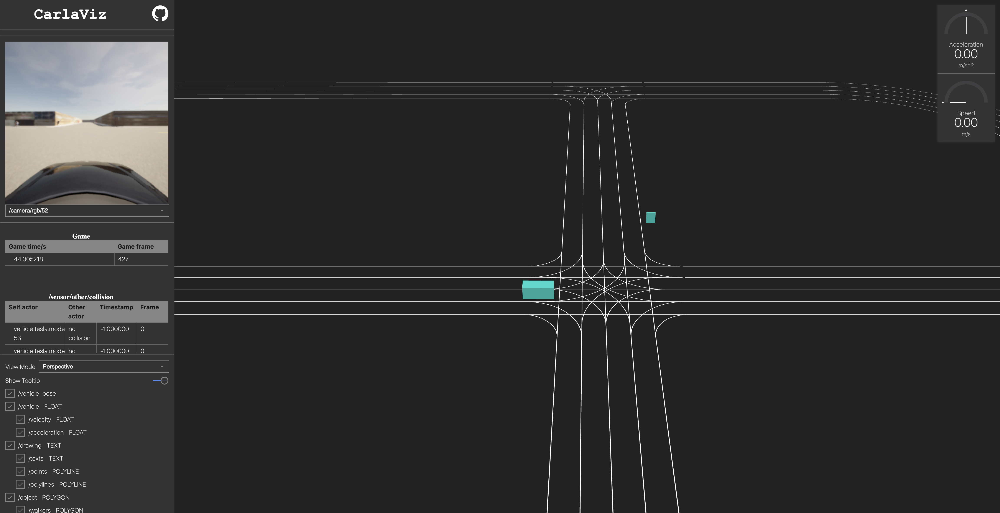

<!--
 * @Date: 2023-01-25 19:36:50
 * @LastEditTime: 2023-04-12 14:02:50
 * @Description: 
-->

<div align="center">

<h1>SafeBench: A Benchmark for Evaluating Autonomous Vehicles in Safety-critical Scenarios</h1>

[](https://safebench.readthedocs.io)
[](https://safebench.github.io)
[](https://arxiv.org/pdf/2206.09682.pdf)
[](#License)
</div>


| Perception Evaluation | Control Evaluation |
| :-------------------: | :----------------: | 
|  |  | 


## Installation

**Recommended system: Ubuntu 20.04 or 22.04**

### 1. Local Installation

<details>
    <summary> Click to expand </summary>

Step 1: Setup conda environment
```bash
conda create -n safebench python=3.8
conda activate safebench
```

Step 2: Clone this git repo in an appropriate folder
```bash
git clone git@github.com:trust-ai/SafeBench.git
```

Step 3: Enter the repo root folder and install the packages:
```bash
cd SafeBench
pip install -r requirements.txt
pip install -e .
```

Step 4: Download our [CARLA_0.9.13](https://drive.google.com/file/d/139vLRgXP90Zk6Q_du9cRdOLx7GJIw_0v/view?usp=sharing) and extract it to your folder.

Step 5: Run `sudo apt install libomp5` as per this [git issue](https://github.com/carla-simulator/carla/issues/4498).

Step 6: Add the python API of CARLA to the ```PYTHONPATH``` environment variable. You can add the following commands to your `~/.bashrc`:
```bash
export CARLA_ROOT={path/to/your/carla}
export PYTHONPATH=$PYTHONPATH:${CARLA_ROOT}/PythonAPI/carla/dist/carla-0.9.13-py3.8-linux-x86_64.egg
export PYTHONPATH=$PYTHONPATH:${CARLA_ROOT}/PythonAPI/carla/agents
export PYTHONPATH=$PYTHONPATH:${CARLA_ROOT}/PythonAPI/carla
export PYTHONPATH=$PYTHONPATH:${CARLA_ROOT}/PythonAPI
```
</details>

### 2. Docker Installation (Beta)

<details>
    <summary> Click to expand </summary>

We also provide a docker image with CARLA and SafeBench installed. Use the following command to launch a docker container:

```bash
bash docker/run_docker.sh
```

The CARLA simulator is installed at `/home/safebench/carla` and SafeBench is installed at `/home/safebench/SafeBench`.

</details>

## Usage

### 1. Desktop Users

<details>
    <summary> Click to expand </summary>

Enter the CARLA root folder, launch the CARLA server and run our platform with
```bash
# Launch CARLA
./CarlaUE4.sh -prefernvidia -windowed -carla-port=2000

# Launch SafeBench in another terminal
python scripts/run.py --agent_cfg basic.yaml --scenario_cfg standard.yaml --mode eval
```
</details>

### 2. Remote Server Users

<details>
    <summary> Click to expand </summary>

Enter the CARLA root folder, launch the CARLA server with headless mode, and run our platform with
```bash
# Launch CARLA
./CarlaUE4.sh -prefernvidia -RenderOffScreen -carla-port=2000

# Launch SafeBench in another terminal
SDL_VIDEODRIVER="dummy" python scripts/run.py --agent_cfg basic.yaml --scenario_cfg standard.yaml --mode eval
```

(Optional) You can also visualize the pygame window using [TurboVNC](https://sourceforge.net/projects/turbovnc/files/).
First, launch CARLA with headless mode, and run our platform on a virtual display.
```bash
# Launch CARLA
./CarlaUE4.sh -prefernvidia -RenderOffScreen -carla-port=2000

# Run a remote VNC-Xserver. This will create a virtual display "8".
/opt/TurboVNC/bin/vncserver :8 -noxstartup

# Launch SafeBench on the virtual display
DISPLAY=:8 python scripts/run.py --agent_cfg basic.yaml --scenario_cfg standard.yaml --mode eval
```

You can use the TurboVNC client on your local machine to connect to the virtual display.
```bash
# Use the built-in SSH client of TurboVNC Viewer
/opt/TurboVNC/bin/vncviewer -via user@host localhost:n

# Or you can manually forward connections to the remote server by
ssh -L fp:localhost:5900+n user@host
# Open another terminal on local machine
/opt/TurboVNC/bin/vncviewer localhost::fp
```
where `user@host` is your remote server, `fp` is a free TCP port on the local machine, and `n` is the display port specified when you started the VNC server on the remote server ("8" in our example).

</details>

### 3. Visualization with CarlaViz

<details>
    <summary> Click to expand </summary>


CarlaViz is a convenient visualization tool for CARLA developed by a former member [mjxu96](https://github.com/mjxu96) of our team. To use CarlaViz, please open another terminal and follow the intructions:
```bash
# pull docker image from docker hub
docker pull mjxu96/carlaviz:0.9.13

# run docker container of CarlaViz
cd Safebench/scripts
sh start_carlaviz.sh
```
Then, you can open the CarlaViz window at http://localhost:8080. You can also remotely access the CarlaViz window by forwarding the port 8080 to your local machine.
</details>

### 4. Scenic users

<details>
    <summary> Click to expand </summary>

If you want to use scenic to control the surrounding adversarial agents, and use RL to control the ego, then first install scenic as follows:

```bash
# Download Scenic repository
git clone https://github.com/BerkeleyLearnVerify/Scenic.git
cd Scenic
python -m pip install -e .
```

Then you can create a directory in ```safebench/scenario/scenario_data/scenic_data```, e.g., ```Carla_Challenge```, and put your scenic files in that directory (the relative map path defined in scenic file should be ```../maps/*.xodr```).

Next, set the param ```scenic_dir``` in ```safebench/scenario/config/scenic.yaml``` with the directory where you store the scenic files, e.g., ```safebench/scenario/scenario_data/scenic_data/Carla_Challenge```, and our code will automatically load all scenic files in that directory.

For selecting the most adversarial scenes, the param ```sample_num``` within the ```scenic.yaml``` serves to determine the number of scenes sampled for each scenic file and the param ```select_num``` is used to specify the number of the most adversarial scenes to be selected from among the sample_num scenes:

```bash
python scripts/run.py --agent_cfg sac.yaml --scenario_cfg scenic.yaml --num_scenario 1 --mode train_scenario
```

Now you can test the ego with these selected adversarial scenes:

```bash
python scripts/run.py --agent_cfg sac.yaml --scenario_cfg scenic.yaml --num_scenario 1 --mode eval
```

Or if you want to Launch it on the virtual display:

```bash
DISPLAY=:8 python scripts/run.py --agent_cfg sac.yaml --scenario_cfg scenic.yaml --num_scenario 1 --mode train_scenario
DISPLAY=:8 python scripts/run.py --agent_cfg sac.yaml --scenario_cfg scenic.yaml --num_scenario 1 --mode eval
``` 
</details>

## Running Arguments

| Argument | Choice | Usage |
| :----: | :----: | :---- |
| `mode` | `{train_agent, train_scenario, eval}` | We provide three modes for training agent, training scenario, and evaluation. |
| `agent_cfg`      | str  |  path to the configuration file of agent. |
| `scenario_cfg`   | str  |  path to the configuration file of scenario. |
| `max_episode_step`      | int     | Number of episode used for training agents and scenario. |
| `num_scenario`  | `{1, 2, 3, 4}` | We support running multiple scenarios in parallel. Current map allows at most 4 scenarios. |
| `save_video`    | store_true     |  We support saving videos during the evaluation mode. | 
| `auto_ego`      | store_true     |  Overwrite the action of ego agent with auto-polit |
| `port`      | int     |  Port used by Carla, default 2000 |
