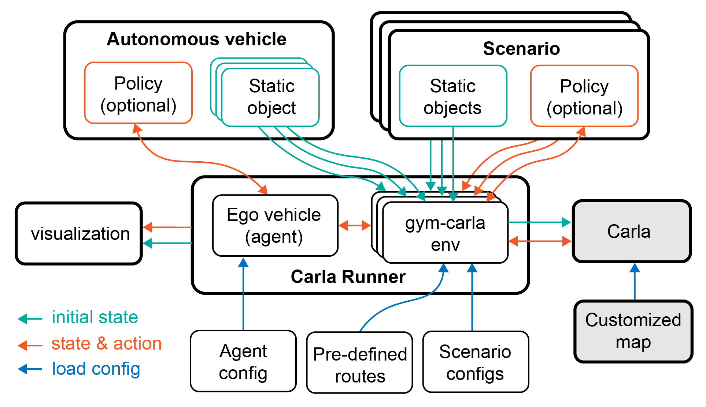

<!--
 * @Date: 2023-01-25 19:36:50
 * @LastEditTime: 2023-03-06 00:20:40
 * @Description: 
-->

# SafeBench

<div style="text-align: center; width:100%; margin: 0 auto; display: inline-block">
<strong>
[
<a href="https://safebench.readthedocs.io">Documentation</a>
|
<a href="">Demo Video</a>
|
<a href="https://ai-secure.github.io/SSAD2023/challenge">Website</a>
|
<a href="https://arxiv.org/pdf/2206.09682.pdf">Paper</a>
]
</strong>
</div>

This is the source code of Safebench platform, which is designed based on Carla to evaluate the security and safety of autonomous driving vehicles. More details about this platform can be found in this [NeurIPS 2022](https://arxiv.org/pdf/2206.09682.pdf) paper.



## Installation
1. Setup conda environment
```
conda create -n safebench python=3.8
conda activate safebench
```

2. Clone this git repo in an appropriate folder
```
git clone git@github.com:trust-ai/SafeBench_v2.git
```

3. Enter the repo root folder and install the packages:
```
pip install -r requirements.txt
pip install -e .
```

4. Download our [CARLA_0.9.13](https://drive.google.com/file/d/1Ta5qtEIrOnpsToQfJ-j0cdRiF7xCbLM3/view?usp=share_link), extract it to your folder.

5. Run `sudo apt install libomp5` as per this [git issue](https://github.com/carla-simulator/carla/issues/4498).

6. Add the python API of CARLA to the ```PYTHONPATH``` environment variable. You can add the following commands to your `~/.bashrc`:
```
export CARLA_ROOT={path/to/your/carla}
export PYTHONPATH=$PYTHONPATH:${CARLA_ROOT}/PythonAPI/carla/dist/carla-0.9.13-py3.8-linux-x86_64.egg
export PYTHONPATH=$PYTHONPATH:${CARLA_ROOT}/PythonAPI/carla/agents
export PYTHONPATH=$PYTHONPATH:${CARLA_ROOT}/PythonAPI/carla
export PYTHONPATH=$PYTHONPATH:${CARLA_ROOT}/PythonAPI
```

## Usage

### 1. Desktop Users

Enter the CARLA root folder, launch the CARLA server and run our platform with
```
# Launch CARLA
./CarlaUE4.sh -prefernvidia -windowed -carla-port=2000

# Launch SafeBench in another terminal
python scripts/run.py --agent_cfg=dummy.yaml --scenario_cfg=example.yaml
```

### 2. Remote Server Users
Enter the CARLA root folder, launch the CARLA server with headless mode, and run our platform with
```
# Launch CARLA
./CarlaUE4.sh -prefernvidia -RenderOffScreen -carla-port=2000

# Launch SafeBench in another terminal
SDL_VIDEODRIVER="dummy" python scripts/run.py --agent_cfg=dummy.yaml --scenario_cfg=example.yaml
```

(Optional) You can also visualize the pygame window using [TurboVNC](https://sourceforge.net/projects/turbovnc/files/).
First, launch CARLA with headless mode, and run our platform on a virtual display.
```
# Launch CARLA
./CarlaUE4.sh -prefernvidia -RenderOffScreen -carla-port=2000

# Run a remote VNC-Xserver. This will create a virtual display "8".
/opt/TurboVNC/bin/vncserver :8 -noxstartup

# Launch SafeBench on the virtual display
DISPLAY=:8 python scripts/run.py --agent_cfg=dummy.yaml --scenario_cfg=example.yaml
```

You can use the TurboVNC client on your local machine to connect to the virtual display.
```
# Use the built-in SSH client of TurboVNC Viewer
/opt/TurboVNC/bin/vncviewer -via user@host localhost:n

# Or you can manually forward connections to the remote server by
ssh -L fp:localhost:5900+n user@host
# Open another terminal on local machine
/opt/TurboVNC/bin/vncviewer localhost::fp
```
where `user@host` is your remote server, `fp` is a free TCP port on the local machine, and `n` is the display port specified when you started the VNC server on the remote server ("8" in our example).
