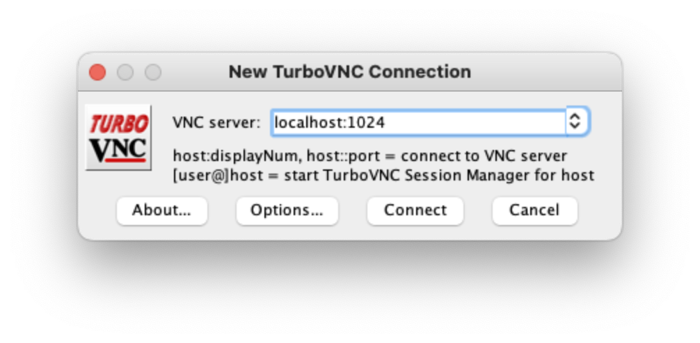

# Running SafeBench on Remote Servers without Display

This tutorial is designed for

  * Remote server users that have several nvidia graphical cards and want to
    effectively use SafeBench on all GPUs.
  * Desktop users who want to use the GPU that is not plugged on the screen for
    rendering CARLA.

On this tutorial you will learn

  * How to configure your docker container to have SafeBench working on rendering without a display attached.
  * How to use TurboVNC to view the contents of SafeBench on your local machine.

You can also check out [this video](https://drive.google.com/file/d/1akOcuhkX0Ip1nD7R6ouzStJkwfZaXLFV/view?usp=sharing) which shows the following steps to run SafeBench on a remote server. Note that in the video it starts from step 3 because the docker image is already ready. You may need to follow the first 2 steps to build your own docker image on the server.

## Preliminaries

This tutorial assumes two machines:

1. A remote server without any display where you will run SafeBench in a docker container.
2. A local machine where you will run the TurboVNC client.

## Remote Configurations

### 1. File Preparation

Assume you are in the current folder (`./docker`). You need to copy some files here. Run the following commands in the current folder.

	cp /etc/X11/xorg.conf xorg.conf
	cp /usr/lib/nvidia nvidia
	cp /usr/lib/xorg/modules xorg
	cp /usr/lib/x86_64-linux-gnu/nvidia/ gnu_nvidia

Make sure the *Files* section in `xorg.conf` include all other paths. Please see the example in the provided `xorg.conf` file.

### 2. Build the Docker image

Run the following command to build the docker image:

	docker build -t garyxcj/carla .

### 3. Launch the Docker Container and Run CARLA

Open a terminal and go to the root foler of this repo. Run the following command:

	bash docker/run_docker.sh

Run the following command inside the docker container. The password for user `carla` is `carla`.

	sudo rm -rf /tmp/.X11-unix/X7
	rm -rf /tmp/.X11-unix/X8
	rm -rf /tmp/.X11-unix/X9

Run your own Xorg. Here I use number 7, but it could be labeled with any free
number

    sudo nohup Xorg :7 &

Run an auxiliary remote VNC-Xserver. This will create a virtual display "8".

    /opt/TurboVNC/bin/vncserver :8

Finally, run CARLA on a certain GPU:

    DISPLAY=:8 vglrun -d :7.0 carla-simulator/CarlaUE4.sh -opengl

Note. This will run CARLA on Xserver 7, device 0. This means you are selecting the GPU 0 on your server. To run on other GPU, run:

    DISPLAY=:8 vglrun -d :7.<gpu_number> carla-simulator/CarlaUE4.sh -opengl

### 4. Launch the entire SafeBench platform

Open a new terminal and access the container:

	docker exec -it safebench /bin/bash

Run an auxiliary remote VNC-Xserver. This will create a virtual display "9".

    /opt/TurboVNC/bin/vncserver :9

Install required packages inside the container:

	cd Evaluation/src/agent/gym_node/
	sudo pip3 install -e .

Complile all files with ROS tools and set up environment:

	cd ~/Evaluation
	catkin_make
	. ./devel/setup.bash

Launch SafeBench: 

	DISPLAY=:9 vglrun -d :7.0 roslaunch manager manager.launch

You can also use specific arguments. For example:

	DISPLAY=:9 vglrun -d :7.0 roslaunch manager manager.launch data_file:=path_to_scenario_data policy:=algorithm_name obs_type:=input_observation_type load_dir:=path_to_saved_model

More details can be found in the launch file: `src/manager/launch/manager.launch`.

## Local Configurations

### 1. Install TurboVNC viewer

You need to install the TurboVNC viewer on your local machine. Follow the steps on the [official website](https://www.turbovnc.org).

### 2. SSH port forwarding

To connect to the remote VNC server you first need to establish a connection between local and remote by using the port forwarding feature of ssh. The port number that you need to forward is computed as:

	PORT = 5900 + N
	
where N is the display port specified when you started the VNC server on remote. The commands for port forwarding with ssh are:

	ssh -L 1024:remote.illinois.edu:5908 username@remote.illinois.edu
	ssh -L 1025:remote.illinois.edu:5909 username@remote.illinois.edu

Here we forward any connection to port 1024 on the local machine to port 5908 on the remote server where the CARLA is displayed. Similarly, port 1025 is used to connect to port 5909 on the remote server where the SafeBench is displayed. You can also use any other available local ports.

### 3. Launch TurboVNC viewer and connect to the server

Launch the TurboVNC viewer on your local machine. A window similar to Fig. 1 should pop up.

Figure 1: TurboVNC viewer connection applet.

To connect to the server you need to enter localhost:X where X is the local port. The Fig. 1 shows an example for X=1024. A window similar to Fig. 2 should pop up.

Figure 2: TurboVNC remote desktop.

