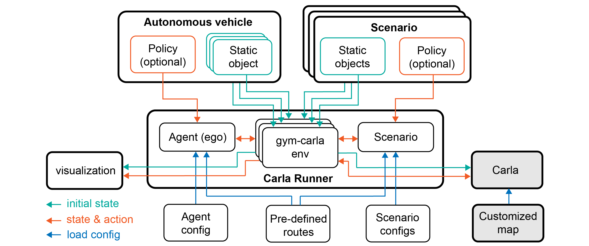

<!--
 * @Date: 2021-07-18 21:46:37
 * @LastEditTime: 2023-03-06 00:20:54
 * @Description: 
-->

# Safebench Components

Safebench is a benchmarking platform based on Carla simulator for evaluating safety and security of autonomous vehicles. The info flowchart of different modules is shown below:

The design of Safebench seperates objects and the policies that control objects to achieve flexible training and evaluation.
Three importort features make Safebench different from existing autonomous driving benchmarks:

* **Efficient Running**

Safebench supports parallel running of multiple scenarios in one map, which dramatically increases the efficiency of colletcing training data and evaluation.

* **Comprehensive Scenarios**

Safebench intergrates lots of scenario-generation algorithms, including data-driven generation, rule-based design and adversarial example. 

* **Usage Coverage**

This benchmark supports three types of running:

1. Train Agent: train policy model of autonomous vehicle with pre-defined scenarios.

2. Train Scenario: train policy model of scenario participants against pre-trained autonomous vehicles.

3. Evaluation: fix both autonomous vehicle and scenario to do evaluation.

---