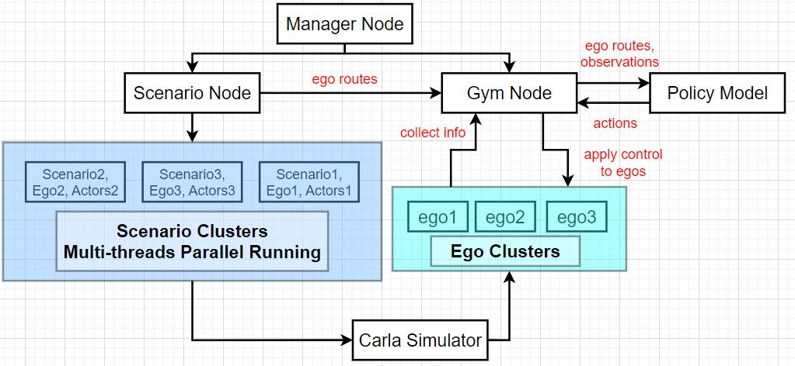

<!--
 * @Author: Wenhao Ding, Shuai Wang
 * @Email: wenhaod@andrew.cmu.edu, shuaiwa2@andrew.cmu.edu
 * @Date: 2021-07-18 21:46:37
 * @LastEditTime: 2022-11-07 21:22:37
 * @Description: 
-->

# Platform System Structure

This is a benchmarking platform for safety evaluation of autonomous vehicles. This platform is based on Carla simulator. The high level structure(for users) of this platform is shown in the following figure:

# Info Flowchart
The information transfer mainly happens among three nodes(manager node, scenario node and gym node) in Ros, the Carla environment and self-chosen policy model. The info flowchart(for developers) among Ros nodes and Carla simulator is shown in the following figure:

---