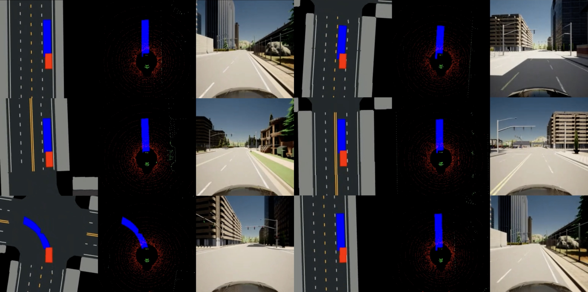

<!--
 * @Date: 2021-07-18 21:43:53
 * @LastEditTime: 2023-03-27 12:18:15
 * @Description: 
-->

# Run Example

We provide an example with a dummy agent and simple scenarios to test whether the installation is successful.

## Option 1. Desktop Users

Enter the CARLA root folder and launch the CARLA server.
```bash
# Launch CARLA
./CarlaUE4.sh -prefernvidia -windowed -carla-port=2000

# Launch SafeBench in another terminal
python scripts/run.py --agent_cfg=dummy.yaml --scenario_cfg=example.yaml
```
where ```--agent_cfg``` is the path to the configuration files of agent and ```--scenario_cfg``` is the path to the configuration files of scenarios.

## Option 2. Remote Server Users

If you use remote server that does not connect any screen, you can use the following commands without visualization window.
Enter the CARLA root folder and launch the CARLA server with headless mode.
```bash
# Launch CARLA
./CarlaUE4.sh -prefernvidia -RenderOffScreen -carla-port=2000

# Launch SafeBench in another terminal
SDL_VIDEODRIVER="dummy" python scripts/run.py --agent_cfg=dummy.yaml --scenario_cfg=example.yaml
```

## Visualization on Remote Server



You can also visualize the pygame window using [TurboVNC](https://sourceforge.net/projects/turbovnc/files/).
First, launch CARLA with headless mode, and run our platform on a virtual display.
```bash
# Launch CARLA
./CarlaUE4.sh -prefernvidia -RenderOffScreen -carla-port=2000

# Run a remote VNC-Xserver. This will create a virtual display "8".
/opt/TurboVNC/bin/vncserver :8 -noxstartup

# Launch SafeBench on the virtual display
DISPLAY=:8 python scripts/run.py --agent_cfg=dummy.yaml --scenario_cfg=example.yaml
```
You can change display `8` to any number but note that vncserver fails if there is already a virtual screen running on this display. 
The parameter `-noxstartup` means no virtual desktop. If you want to launch all things in a virtual desktop, please remove this parameter.

Then, you can use the TurboVNC client on your local machine to connect to the virtual display.
```bash
# Use the built-in SSH client of TurboVNC Viewer
/opt/TurboVNC/bin/vncviewer -via user@host localhost:n

# Or manually forward connections to the remote server
ssh -L fp:localhost:5900+n user@host
/opt/TurboVNC/bin/vncviewer localhost::fp
```
where `user@host` is your remote server, `fp` is a free TCP port on the local machine, and `n` is the display port specified when you started the VNC server on the remote server ("8" in our example).


## Visualization with CarlaViz


CarlaViz is a convenient visualization tool for CARLA developed by a former member [mjxu96](https://github.com/mjxu96) of our team. To use CarlaViz, please open another terminal and follow the intructions:
```bash
# pull docker image from docker hub
docker pull mjxu96/carlaviz:0.9.13

# run docker container of CarlaViz
cd Safebench/scripts
sh start_carlaviz.sh
```
Then, you can open the CarlaViz window at http://localhost:8080. You can also remotely access the CarlaViz window by forwarding the port 8080 to your local machine.


## Scenic users

If you want to use scenic to control the surrounding adversarial agents, and use RL to control the ego, then first install scenic as follows:

```bash
# Download Scenic repository
git clone https://github.com/BerkeleyLearnVerify/Scenic.git
cd Scenic
python -m pip install -e .
```

For seleting the most adversarial scenes (```num_scenario```  has to be 1 currently), use

```bash
python scripts/run.py --agent_cfg=sac.yaml --scenario_cfg=scenic.yaml --num_scenario 1 --mode train_scenario
```

And then test the agent with these selected adversarial scenes:

```bash
python scripts/run.py --agent_cfg=sac.yaml --scenario_cfg=scenic.yaml --num_scenario 1 --mode eval
```

Or if you want to Launch it on the virtual display

```bash
DISPLAY=:8 python scripts/run.py --agent_cfg=sac.yaml --scenario_cfg=scenic.yaml --num_scenario 1 --mode eval
``` 
