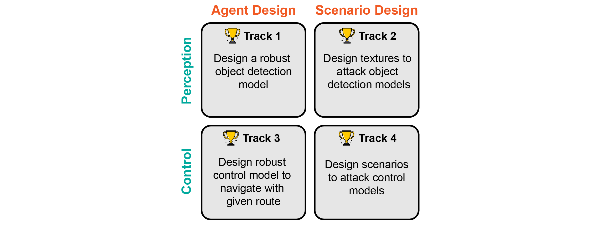

<!--
 * @Author: 
 * @Email: 
 * @Date: 2021-07-18 21:46:37
 * @LastEditTime: 2023-03-01 20:49:59
 * @Description: 
-->

# Challenge Tracks

In the challenge, we prepare 4 tracks covering the safety and security of both perception and control modules in autonomous driving. 
Two of the tracks aims to develop robust agents to deal with potential safety and security problems in scenarios. 
The other two tracks focus on designing scenarios that can attack agents.
The detailed description of these tracks are introduced below.

## Track 1 (Perception Attack)

### Mission
This track still focuses on the object detection task but the goal is to design texture of traffic objects to attack object detection models.

### Metric
The metrics we evaluate are the IoU and accuracy of the detection results.

## Track 2 (Perception Defense)

### Mission
This track focuses on the object detection task for front view images. There are many powerful off-the-shelf models but they may not be strong enough to defense attacks happen traffic scenarios, e.g., a mask on stop sign.
In this track, the participants are required to design a robust object detection model. This model will be evaluated under scenarios that contains attacks on textures of stop sign and surrounding vehicle.

TODO: add one screenshot

### Metric
The metric we evaluate is the IoU and accuracy of the detection results.

## Track 3 (Planning Attack)

### Mission
This track still focuses on control tasks but the goal is to design scenarios that can make agents either fail to finish the route or collide with other objects.

### Metric
The metrics we evaluate are ...

## Track 4 (Planning Defense)

### Mission
This track focuses on evaluating the safety and security of control models that follow a given route. We assume that the agent can access perfect observation, including the position and surrounding vehicles, traffic light status, and planning route.
The goal is to design robust agents that can avoid collision and finish route.

TODO: add one screenshot

### Metric
The metrics we evaluate are ...
